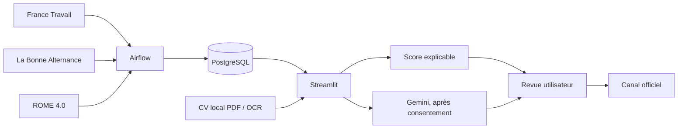

# Assistant IA de compatibilité et candidature emploi

Proof of concept Data Engineering et IA responsable : l'application synchronise
des offres d'emploi et d'alternance dans PostgreSQL, puis aide un candidat à les
rechercher, comprendre leur compatibilité et préparer sa candidature. Elle ne
postule jamais à sa place.

**Démonstration :** [emploi.amadouadjanouhoun.fr](https://emploi.amadouadjanouhoun.fr)

## Ce que démontre le POC

- ingestion planifiée d'offres **France Travail**, avec un périmètre Île-de-France
  en développement et national en production ;
- import quotidien des offres **La Bonne Alternance** ;
- persistance, déduplication et consultation des offres depuis **PostgreSQL** ;
- enrichissement métier et compétences par le référentiel **ROME 4.0** ;
- score de compatibilité déterministe, explicable et indépendant de l'IA ;
- lecture locale d'un CV PDF, avec repli OCR lorsque le texte n'est pas
  exploitable ;
- profil candidat JSON proposé par **Gemini** uniquement après consentement,
  avec extraits de preuve issus du CV et possibilité de correction ;
- génération à la demande d'un brouillon de lettre de motivation et d'un e-mail
  d'envoi ;
- redirection vers le canal de candidature officiel après validation humaine.

Les données personnelles du candidat restent temporaires dans sa session : le
CV, le texte extrait, les coordonnées et les brouillons ne sont pas conservés
dans l'historique applicatif.

## Architecture



Les connecteurs sont interchangeables. Chaque source est normalisée vers un
modèle d'offre interne et conserve sa provenance. Un enrichissement ROME
indisponible ne masque pas l'offre : celle-ci reste consultable avec son statut.

## Orchestration et stockage

Deux DAG Airflow alimentent la même base PostgreSQL que consulte Streamlit :

| DAG | Cadence | Rôle |
| --- | --- | --- |
| `national_offer_sync` | toutes les 6 heures | synchronisation France Travail |
| `lba_offer_sync` | chaque jour à 03:20 (Europe/Paris) | import La Bonne Alternance |

Les synchronisations enregistrent leur état, le nombre d'offres vues, les
segments traités et les erreurs éventuelles. Les offres immédiatement expirées
sont retirées des résultats visibles ; les journaux d'exécution sont conservés
30 jours.

Le connecteur La Bonne Alternance gère l'export de production, y compris lorsque
celui-ci est renvoyé comme un tableau JSON brut avec le type
`application/octet-stream`.

## IA : rôle et limites

Gemini ne décide pas de l'adéquation du candidat et ne réalise aucune
candidature automatique. Son rôle est limité à :

1. transformer, avec consentement, le texte du CV en proposition de profil
   structurée et éditable ;
2. expliquer un résultat à partir des données déjà calculées ;
3. préparer un brouillon de lettre de motivation et d'e-mail à faire relire.

Avant utilisation, les réponses structurées sont validées contre le contrat
attendu ; les informations de profil non reliées à un extrait du CV sont
rejetées. Le score reste calculé localement à partir des compétences, critères
et éléments manquants.

## Lancer localement

### Prérequis

- Docker et Docker Compose ;
- des identifiants France Travail et, si souhaité, La Bonne Alternance et Gemini.

Créer l'environnement local à partir de l'exemple :

```bash
cp .env.example .env
```

Renseigner dans `.env` les variables nécessaires. Ne jamais versionner ce
fichier ni y recopier de secret dans un journal ou une capture.

Pour démarrer l'ensemble de l'environnement :

```bash
docker compose --env-file .env up --build
```

L'interface Streamlit est disponible sur `http://localhost:8501` par défaut.
PostgreSQL et Airflow sont internes au réseau Docker ; l'API Airflow n'est
exposée qu'en local sur le port 8080.

Pour une itération interface rapide sans les services conteneurisés :

```bash
python3 -m venv .venv
source .venv/bin/activate
python -m pip install -e '.[dev]'
streamlit run app.py
```

## Tests

```bash
python -m pytest
```

Les tests couvrent notamment les contrats des connecteurs, la déduplication, la
compatibilité explicable, l'extraction de CV, le consentement Gemini et le
format réel de l'export La Bonne Alternance. Les documents de test sont
synthétiques.

## Déploiement

Le POC est déployé sur un VPS OVH avec Docker Compose. Nginx assure le HTTPS et
le proxy inverse vers Streamlit ; PostgreSQL et Airflow ne sont pas publiés sur
Internet. Les limites Airflow sont volontairement réglées à deux tâches globales
et une tâche par DAG afin de cohabiter avec d'autres projets sur le même
VPS.

Les instructions reproductibles sont dans
[la documentation de déploiement](docs/DEPLOIEMENT_OVH.md).

## Documentation projet

- [État des lieux initial](docs/sprints/SPRINT_0_ETAT_DES_LIEUX.md)
- [Architecture](docs/ARCHITECTURE.md)
- [Contrat des connecteurs](docs/CONNECTEURS.md)
- [Parcours Streamlit](docs/PARCOURS_STREAMLIT.md)
- [Sécurité et données personnelles](docs/SECURITE_DONNEES.md)
- [Déploiement OVH](docs/DEPLOIEMENT_OVH.md)
- [Feuille de route](docs/ROADMAP.md)
- [Journal technique](JOURNAL_TECHNIQUE.md)
- [États des lieux par sprint](docs/sprints)

## Structure

```text
app.py                                   Interface Streamlit
pages/                                   Parcours recherche et candidature
src/candidature_emploi/domain/           Modèle métier indépendant des sources
src/candidature_emploi/application/      Cas d'usage et synchronisations
src/candidature_emploi/infrastructure/   Connecteurs, IA, CV et persistance
dags/                                    Planification Airflow
db/                                      Schéma PostgreSQL initial
docs/                                    Architecture, sprints et exploitation
tests/                                   Tests unitaires et d'intégration
```
