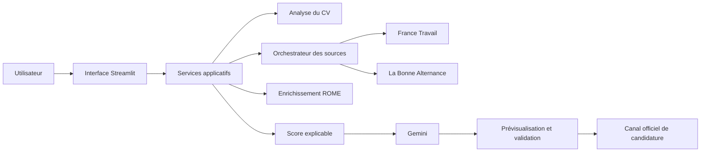

# Architecture cible du POC

## 1. Vue fonctionnelle

## 2. Couches

### Présentation

Streamlit affiche le parcours candidat et l’administration des sources. Cette
couche ne contient ni logique fournisseur ni secret.

### Application

Elle orchestre l’import du CV, la recherche, la normalisation, la déduplication,
le rapprochement, la génération du brouillon et la confirmation.

### Domaine

Cette couche contient les objets indépendants des fournisseurs :

- `CandidateProfile` ;
- `JobOffer` ;
- `Skill` ;
- `MatchResult` ;
- `ApplicationDraft` ;
- `ProviderStatus`.

### Infrastructure

Elle contient les implémentations des connecteurs, la persistance, les clients
HTTP et le fournisseur d’IA.

## 3. Flux d’une recherche

1. L’utilisateur choisit le type de recherche et ses critères.
2. L’orchestrateur sélectionne uniquement les connecteurs actifs compatibles.
3. Chaque connecteur renvoie des offres normalisées.
4. Le système conserve la provenance de chaque champ.
5. Les doublons sont rapprochés sans supprimer leur traçabilité.
6. ROME enrichit les métiers et compétences lorsque nécessaire.
7. Le moteur calcule un résultat explicable.
8. Gemini produit uniquement une explication ou un brouillon à partir des
   éléments autorisés.

## 4. Principe de remplacement

Le domaine dépend d’une interface de connecteur, jamais d’un fournisseur. Un
nouveau connecteur peut être ajouté au registre, testé, activé puis priorisé.
Le retrait d’un fournisseur ne modifie pas le moteur de rapprochement.

## 5. Décisions différées

La structure Python exacte, le framework de validation, la base de données et le
mode d’exécution asynchrone seront décidés avant l’implémentation, à partir des
besoins mesurés du POC.

